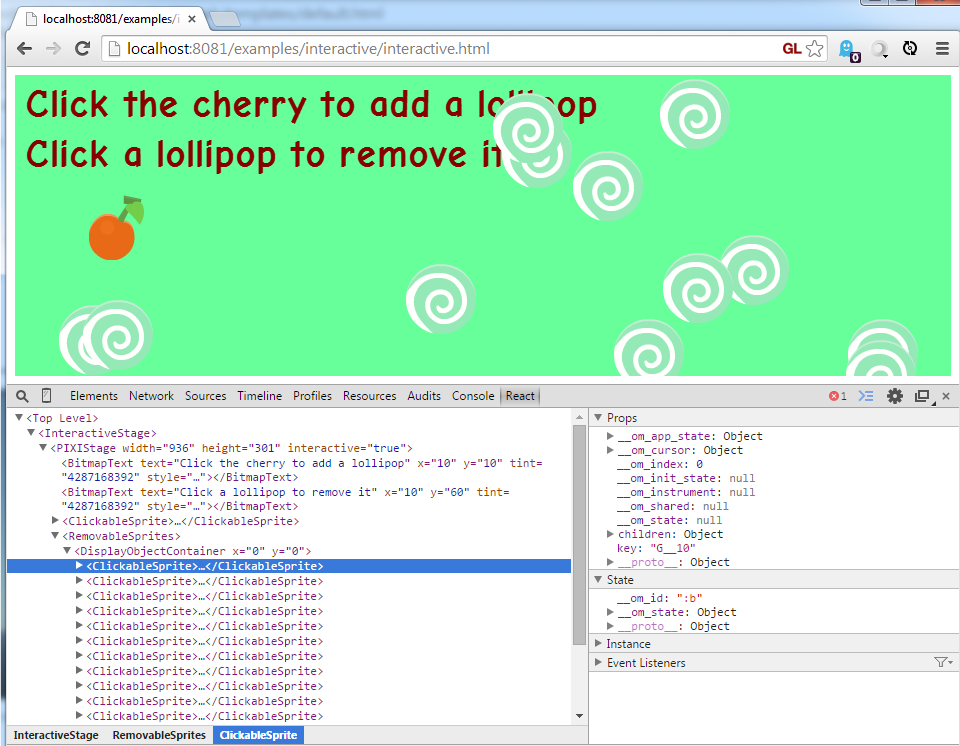

om-react-pixi
=============



Bindings for om to let you create and control pixi sprites from clojurescript.

A simple example displaying text on a 400px by 300px (possibly WebGL) canvas:

```
(defn simplestage [cursor]
  (om/component
   (pixi/stage #js {:width 400 :height 300}
    (pixi/text #js {:x 100 :y 100 :text "argh!"}))))
```

Provided Forms
----

Includes the standard items from PixiJS:

- Stage
- Sprite
- TilingSprite
- Text
- BitmapText
- DisplayObjectContainer

## Running the examples

Build the examples using cljsbuild

```
lein cljsbuild once
```

The interactive example can be driven by figwheel, allowing you to edit the interactive
example source and auto-reload

```
lein figwheel interactive
```

